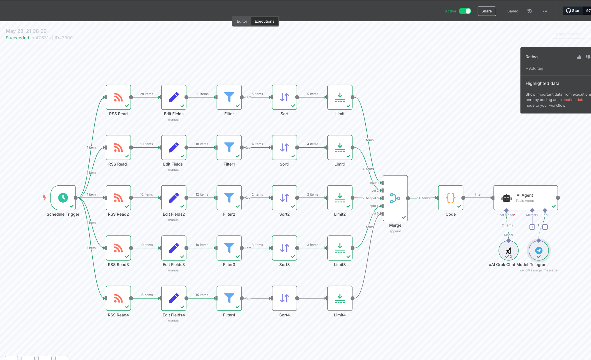

# n8n RSS Feed Processing and AI Analysis Workflow

This repository contains an n8n workflow designed for automated RSS feed processing with AI-powered analysis and content distribution.

## Workflow Overview

## Workflow Components and Flow

### 1. **Schedule Trigger**
- **Purpose**: Initiates the workflow automatically at scheduled intervals
- **Configuration**: Runs periodically to check for new RSS content
- **Output**: Triggers the entire workflow chain

### 2. **RSS Feed Processing (4 Parallel Branches)**
The workflow processes 4 different RSS feeds simultaneously:

#### Branch 1: RSS Read → Edit Fields → Filter → Sort → Limit
- **RSS Read**: Fetches 28 items from the first RSS feed
- **Edit Fields**: Transforms and standardizes data fields (manual configuration)
- **Filter**: Applies filtering criteria to select relevant items (5 items pass)
- **Sort**: Orders items based on specified criteria (5 items)
- **Limit**: Restricts output to a specific number of items (5 items)

#### Branch 2: RSS Read1 → Edit Fields1 → Filter1 → Sort1 → Limit1
- **RSS Read1**: Fetches 10 items from the second RSS feed
- **Edit Fields1**: Data transformation (manual configuration)
- **Filter1**: Content filtering (4 items pass)
- **Sort1**: Item ordering (4 items)
- **Limit1**: Output limitation (4 items)

#### Branch 3: RSS Read2 → Edit Fields2 → Filter2 → Sort2 → Limit2
- **RSS Read2**: Fetches 12 items from the third RSS feed
- **Edit Fields2**: Field editing and transformation (manual)
- **Filter2**: Content filtering (2 items pass)
- **Sort2**: Item sorting (2 items)
- **Limit2**: Output control (2 items)

#### Branch 4: RSS Read3 → Edit Fields3 → Filter3 → Sort3 → Limit3
- **RSS Read3**: Fetches 10 items from the fourth RSS feed
- **Edit Fields3**: Data processing (manual configuration)
- **Filter3**: Item filtering (3 items pass)
- **Sort3**: Content ordering (3 items)
- **Limit3**: Final output limitation (3 items)

#### Branch 5: RSS Read4 → Edit Fields4 → Filter4 → Sort4 → Limit4
- **RSS Read4**: Fetches 15 items from the fifth RSS feed
- **Edit Fields4**: Manual field configuration
- **Filter4**: Content filtering
- **Sort4**: Item organization
- **Limit4**: Output management

### 3. **Data Aggregation and Processing**

#### Merge Node
- **Purpose**: Combines processed data from all 5 RSS feed branches
- **Input**: Receives filtered and sorted items from each branch
- **Output**: Consolidated dataset for further processing

#### Code Node
- **Purpose**: Custom JavaScript processing of merged data
- **Input**: Combined RSS feed data (5 items total)
- **Processing**: Likely performs data transformation, deduplication, or custom logic
- **Output**: Processed dataset (1 item)

### 4. **AI Analysis Integration**

#### AI Agent
- **Platform**: Uses Agent (possibly OpenAI or similar AI service)
- **Input**: Processed data from the Code node
- **Purpose**: Performs intelligent analysis, summarization, or content generation
- **Output**: AI-enhanced content

### 5. **Multi-Channel Distribution**

The workflow concludes with dual distribution channels:

#### xAI Grok Chat Model
- **Platform**: Integrates with xAI's Grok AI model
- **Purpose**: Further AI processing or chat-based analysis
- **Use Case**: Likely for conversational AI or advanced content analysis

#### Telegram Integration
- **Platform**: Telegram messaging service
- **Purpose**: Distributes processed content to Telegram channels/chats
- **Use Case**: Content delivery and notification system

## Key Features

- **Multi-Source RSS Aggregation**: Processes 5 different RSS feeds simultaneously
- **Intelligent Filtering**: Each branch applies custom filtering logic
- **Data Standardization**: Edit Fields nodes ensure consistent data format
- **Scalable Processing**: Parallel processing for efficient handling
- **AI-Powered Analysis**: Integrates multiple AI services for content enhancement
- **Multi-Channel Distribution**: Delivers content through various platforms

## Workflow Benefits

1. **Automation**: Fully automated RSS monitoring and processing
2. **Scalability**: Handles multiple RSS sources concurrently
3. **Intelligence**: AI-powered content analysis and enhancement
4. **Flexibility**: Customizable filtering and processing rules
5. **Distribution**: Multi-platform content delivery

## Use Cases

- **News Aggregation**: Collecting and analyzing news from multiple sources
- **Content Curation**: Filtering and organizing relevant content
- **Social Media Management**: Automated content distribution
- **Market Research**: Monitoring industry trends and developments
- **Content Intelligence**: AI-powered insights and summaries

## Technical Requirements

- n8n workflow automation platform
- RSS feed sources
- AI service access (OpenAI, xAI Grok)
- Telegram Bot API access
- Scheduled execution capability

---

*Created on May 23, 2025*
*Workflow Status: Successfully executed with 476316 items processed*